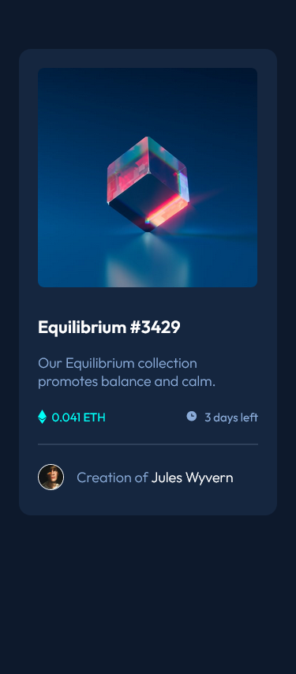
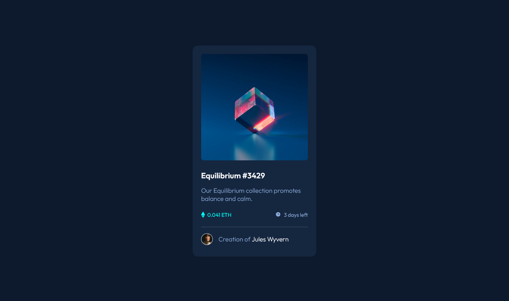

# Frontend Mentor - NFT preview card component solution

This is a solution to the [NFT preview card component challenge on Frontend Mentor](https://www.frontendmentor.io/challenges/nft-preview-card-component-SbdUL_w0U). Frontend Mentor challenges help you improve your coding skills by building realistic projects. 

## Table of contents

- [Overview](#overview)
  - [The challenge](#the-challenge)
  - [Screenshot](#screenshot)
  - [Links](#links)
- [My process](#my-process)
  - [Built with](#built-with)
  - [What I learned](#what-i-learned)
  - [Continued development](#continued-development)
  - [Useful resources](#useful-resources)
- [Author](#author)

## Overview

### The challenge

Users should be able to:

- View the optimal layout depending on their device's screen size
- See hover states for interactive elements

### Screenshot

### Links

- Solution URL: [Github](https://github.com/jbuast/nft-preview-card.git)
- Live Site URL: [Github Page](https://jbuast.github.io/nft-preview-card/)

## My process

### Built with

- Semantic HTML5 markup
- CSS custom properties
- Flexbox
- CSS Grid
- SASS
- Mobile-first workflow

### What I learned

I made this project to familiarize myself to HTML and CSS. In my next project I will try to make landing page to uphill the difficulty of the challenges. 

### Continued development

The next project I will be making will be a landing page. I want to challenge myself into difficult task and improve along the way.

### Useful resources

- [MDN Web Docs](https://developer.mozilla.org/en-US/) - This helped me understand and guides me by providing comprehensive documentation on web development technologies such as HTML and CSS.
- [ChatGPT](https://chat.openai.com/) - This is very helpful to me. It is like a mentor because it can explain to you the block of codes.

## Author

- Website - [Github Page](https://jbuast.github.io/nft-preview-card/)
- Frontend Mentor - [@jbuast](https://www.frontendmentor.io/profile/jbuast)
